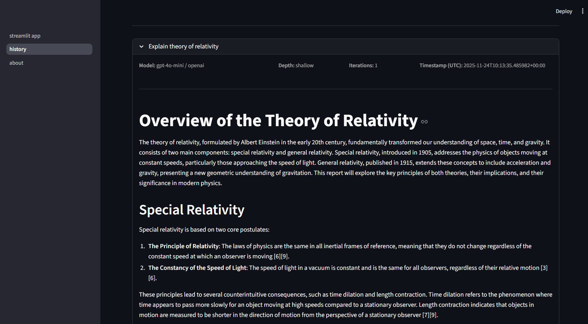

<div align="center">
  <h1>Web Research Agent</h1>
  <p>
    An AI-powered research assistant that uses a team of agents to answer questions and generate comprehensive reports.
  </p>
  <p>
    <a href="https://github.com/Sagnnik/agent_orchestration/issues">Report Bug</a>
    ·
    <a href="https://github.com/Sagnnik/agent_orchestration/issues">Request Feature</a>
  </p>
</div>

[](https://github.com/Sagnnik/agent_orchestration/tree/main/web_research)
[](https://opensource.org/licenses/MIT)
[](https://github.com/Sagnnik/agent_orchestration/pulls)

## 🎥 Live Demo

[Link to Live Demo](assets/demo.mp4)

## 📸 Screenshots

| Screenshot 1                                     | Screenshot 2                                     |
| ------------------------------------------------ | ------------------------------------------------ |
|  |  |

## 🧠 Graph
|  | 

## ✨ Features

*   **🤖 AI-Powered Research:** Leverages large language models to automate your research tasks.
*   **🤝 Multi-Agent System:** A team of specialized AI agents collaborate to deliver the best results.
*   **🌐 Multiple Search Tools:** Agents can use a variety of tools like Google Search, Wikipedia, and Arxiv to gather information.
*   **⚡️ Async Support:** Built with asyncio to handle long-running research tasks without blocking the UI.
*   ** interactive Frontend:** A user-friendly Streamlit interface to submit queries, monitor progress, and view reports.
*   **⬇️ Downloadable Reports:** Download research reports as PDFs for offline viewing and sharing.
*   **🐳 Dockerized:** The entire application is containerized for easy setup and deployment.

## 🏗️ Architecture

The application is composed of three main services orchestrated by Docker Compose:

1.  **🚀 Backend (FastAPI):** Handles the core logic of the research agent, including planning, searching, and synthesizing information. It uses LangChain and LangGraph to define the agentic workflow and communicates with Redis to store and retrieve agent state.
2.  **🎨 Frontend (Streamlit):** Provides an interactive web interface for users to submit research queries, view the agent's progress, and see the final report. It communicates with the backend via HTTP requests.
3.  **📦 Redis:** An in-memory data store used as a cache and a checkpointer for the LangGraph agent state, ensuring persistence and quick retrieval of data.

## 🛠️ Technology Stack

*   **Backend:** Python, FastAPI, LangChain, LangGraph
*   **Frontend:** Python, Streamlit
*   **Database/Cache:** Redis
*   **Containerization:** Docker, Docker Compose

## 🚀 Getting Started

To get started with the project, ensure you have Docker and Docker Compose installed.

1.  **Clone the repository:**
    ```bash
    git clone https://github.com/Sagnnik/agent_orchestration.git
    cd agent_orchestration/web_research
    ```

2.  **Environment Variables:**
    Create a `.env` file in the root of the project and add the necessary environment variables. You can refer to the `.env.example` file for the required variables.

3.  **Build and run the services:**
    ```bash
    docker-compose up --build
    ```

This will build the Docker images for the frontend and backend services and start all the services.

*   The frontend will be available at [http://localhost:8501](http://localhost:8501)
*   The backend API will be available at [http://localhost:8000/docs](http://localhost:8000/docs)

## 🤝 Contributing

Contributions are what make the open-source community such an amazing place to learn, inspire, and create. Any contributions you make are **greatly appreciated**.

To contribute, please follow these steps:

1.  Fork the Project
2.  Create your Feature Branch (`git checkout -b feature/AmazingFeature`)
3.  Commit your Changes (`git commit -m 'Add some AmazingFeature'`)
4.  Push to the Branch (`git push origin feature/AmazingFeature`)
5.  Open a Pull Request

## 📜 License

Distributed under the MIT License. See `LICENSE` for more information.

## 📬 Contact

Your Name - [@b_sagnnik](https://x.com/b_sagnnik)

Project Link: [https://github.com/Sagnnik/agent_orchestration/tree/main/web_research](https://github.com/Sagnnik/agent_orchestration/tree/main/web_research)

<details>
<summary>## Progress</summary>

# Web-Researcher: v1
# Core
	[ x ] Remove the webscraper for v1. Will add in v2
	[ x ] Test out the tools individually
	[ x ] Get the planning node running
	[ x ] Get the search node running
	[ x ] Get the synthesis node running
	[ x ] Get the reviwer node and router running
	[ x ] Make streaming tokens work
	[ x ] Async implementation of the nodes
	[ x ] Integrate LangSmith
	[ x ] Cache the graph in memory
	[ x ] Replaced Memory Saver to redis checkpointer
	
	[ - ] Keep the all the prompts in one prompts.py
	[ - ] Model inject
	[ - ] LLM stays loaded on gpu on error [Not using ollama]
	[ - ] LLM thinking .additional_kwargs nor working [No thinking models]
#### Maybe v1? or v2.
	[ ] HIL implementation maybe?
	[ ] Crawler implementation with crawl4ai maybe?
	[ ] Will add Ollama support?

# APP Backend
	[ x ] Complete the API routes
		- sync route (internal testing)
		- async background task route
		- async fetch result route
		- SSE route
	[ x ] Implement logging (loguru)
	[ x ] cancel option (both stream and graph execution) 
	[ ] Same query reports needs to be fetched from redis cache

# Streamlit APP
	[ x ] Dont display laggraph Runnable nodes
	[ x ] add health check on the sidebar
	[ - ] Cancel search button
		- needs background worker to handle streaming(blocking task)
	[ x ] add a page for the report history / chat history
	[ - ] agent response is streamed into chat_reponse container
		- Not needed
	[ x ] Load history from session state
	[ x ] PDF download as well
	[ x ] Use the gemini cli to create the about page / README.md


# Dockerize 
	[ x ] DockerFile for fastapi backend
	[ x ] DockerFile for streamlit frontend
	[ x ] Docker-Compose with redis, backend, frontend
</details>