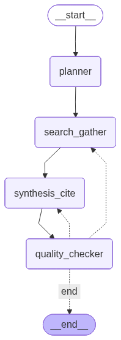

# LangGraph Research Agent

This project implements a multi-step, autonomous research agent using [LangGraph](https://python.langchain.com/docs/langgraph/). The agent is designed to take a user's research query and perform a series of steps to generate a comprehensive and well-cited report. The agent can plan its research, gather information from multiple sources, synthesize the findings, and iteratively refine the report based on quality checks.

## Features

- **Multi-step Research Process**: The agent follows a structured research workflow:
    1.  **Plan**: Creates a detailed research plan based on the user's query and desired depth.
    2.  **Search**: Executes searches across multiple tools like Tavily, Wikipedia, and Arxiv.
    3.  **Synthesize**: Generates a report with proper citations from the gathered information.
    4.  **Quality Check**: Evaluates the report's quality and decides whether to revise, conduct more research, or finalize the report.
- **Iterative Refinement**: The agent can loop through the search, synthesis, and quality check steps multiple times to improve the report's quality.
- **Stateful Execution**: Utilizes LangGraph's checkpointer mechanism to maintain the state of the research process, allowing for persistent and resumable sessions (supports in-memory and Redis).
- **Streaming Support**: Provides real-time streaming of the research process, allowing users to see the agent's progress as it happens.
- **Configurable**: The research depth (`SHALLOW`, `MODERATE`, `DEEP`) and the maximum number of iterations can be configured.

## Architecture

The core of the agent is a `StateGraph` defined in `graph.py`. The state of the graph is represented by the `ResearchState` TypedDict (`state_graph.py`), which holds all the data passed between the different steps of the research process.

The graph consists of the following nodes:

- **`planner`**: This is the entry point of the graph. It takes the user's query and generates a `QueryPlanOutput`, which includes a list of search queries to execute.
- **`search_gather`**: This node executes the search queries from the plan using the available tools (`Tavily`, `Wikipedia`, `Arxiv`). It aggregates the results and adds them to the state.
- **`synthesis_cite`**: This node takes the search results and generates a research report with citations.
- **`quality_checker`**: This node evaluates the generated report. It checks if the report meets the quality standards and decides on the next action:
    - **Revise**: If the report needs minor changes, it sends the flow back to the `synthesis_cite` node.
    - **Research More**: If more information is needed, it sends the flow back to the `search_gather` node with additional queries.
    - **End**: If the report is satisfactory, it ends the process.

### Graph Structure

The following diagram illustrates the flow of the research agent's graph:



The diagram shows the cyclical nature of the graph, where the agent can iteratively refine its research by moving between the `search_gather`, `synthesis_cite`, and `quality_checker` nodes until a satisfactory result is achieved.

## How to Use

To run the research agent, you can use the `create_agent` function from `agent.py`. Here is a basic example:

```python
from uuid import uuid4
from core.agent import create_agent

thread_id = uuid4()
query = "What are the latest advancements in AI?"

# Run the agent
result = create_agent(thread_id, query)

# Print the final report
if result.get("synthesis"):
    print("Final Report:")
    print(result["synthesis"].report)
else:
    print("An error occurred during the research process.")

```

For real-time updates, you can use the `create_agent_streaming` function:

```python
import asyncio
from uuid import uuid4
from core.agent import create_agent_streaming

async def main():
    thread_id = uuid4()
    query = "What are the latest advancements in AI?"

    async for event in create_agent_streaming(thread_id, query):
        # Process each event from the stream
        print(event)

if __name__ == "__main__":
    asyncio.run(main())
```

## Key Components

- **`agent.py`**: The main entry point for creating and running the research agent.
- **`graph.py`**: Defines the LangGraph structure, nodes, and edges.
- **`state_graph.py`**: Defines the `ResearchState` TypedDict, which represents the state of the graph.
- **`prompts/`**: Contains the prompts used by the LLM in each node of the graph.
- **`tools/`**: Contains the search tools used by the `search_gather` node.
- **`llm.py`**: Handles the initialization of the language model.
- **`llm_response_models.py`**: Defines the Pydantic models for the structured output from the LLM.

## Future Enhancements (v2)

Version 2 will introduce advanced capabilities including a dedicated web scraping node, a hierarchical summarizer for multi-document synthesis, and a smart retriever node to efficiently manage and extract insights from extensive scraped data.
